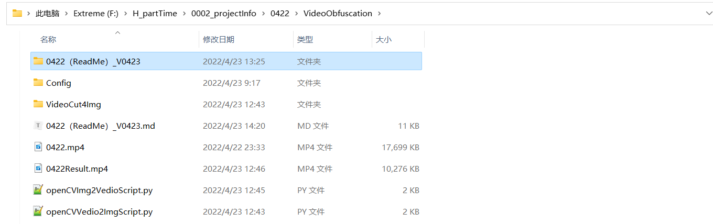
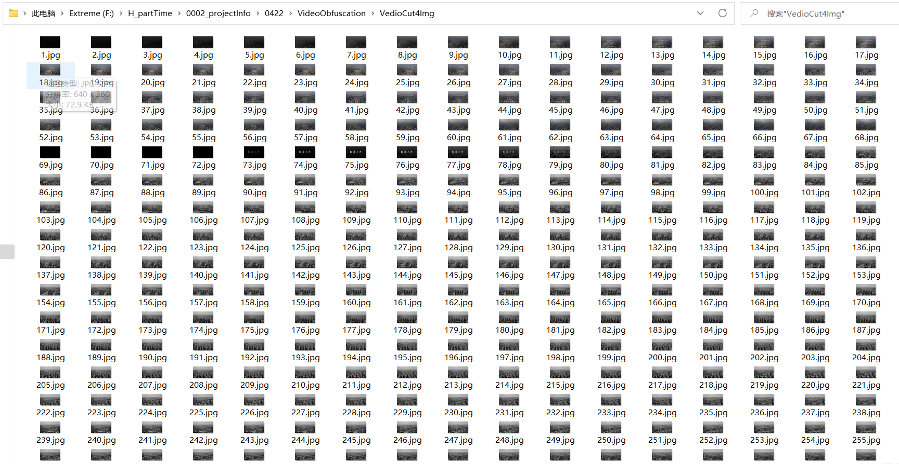
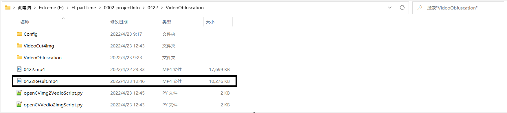
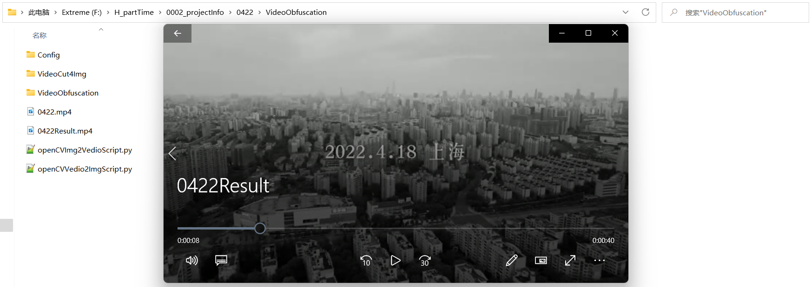

## -1.声明及版权信息

### -1.1.特别声明

* 本仓库发布的`VideoObfuscation`项目中涉及的任何脚本，仅用于测试和学习研究，禁止用于商业用途，不能保证其合法性，准确性，完整性和有效性，请根据情况自行判断。

* 本项目内所有资源文件，禁止任何公众号、自媒体进行任何形式的转载、发布。

* `tuoxieleng` 对任何脚本问题概不负责，包括但不限于由任何脚本错误导致的任何损失或损害。

* 间接使用脚本的任何用户，包括但不限于建立VPS或在某些行为违反国家/地区法律或相关法规的情况下进行传播, `tuoxieleng` 对于由此引起的任何隐私泄漏或其他后果概不负责。

* 请勿将`VideoObfuscation`项目的任何内容用于商业或非法目的，否则后果自负。

* 如果任何单位或个人认为该项目的脚本可能涉嫌侵犯其权利，则应及时通知并提供身份证明，所有权证明，我将在收到认证文件后删除相关脚本。

* 以任何方式查看此项目的人或直接或间接使用`VideoObfuscation`项目的任何脚本的使用者都应仔细阅读此声明。`tuoxieleng` 保留随时更改或补充此免责声明的权利。一旦使用并复制了任何相关脚本或`VideoObfuscation`项目，则视为您已接受此免责声明。  

* 本项目遵循`GPL-3.0 License`协议，如果本特别声明与`GPL-3.0 License`协议有冲突之处，以本特别声明为准。

> ***您使用或者复制了本仓库且本人制作的任何代码或项目，则视为`已接受`此声明，请仔细阅读***  
> ***您在本声明未发出之时点使用或者复制了本仓库且本人制作的任何代码或项目且此时还在使用，则视为`已接受`此声明，请仔细阅读***

## 0.内容安全

### 0.1.名词概述

>国内安全厂商内容安全主要依靠深度学习算法及强大的算力平台，形成的包含智能文本安全、图像安全、语音安全、视频安全等在内的一站式安全管控体系。以精准识别内容中涉黄、涉政、暴恐、 违禁、广告等多类违规风险。

### 0.2.技术解析

#### 0.2.1.个人理解

有过几年风控行业的工作经验，说一下自己的`理解`。

>“文字&图片”、“音频&语音”、“直播&短视频”、“行为数据”等维度信息经由SDK结合API接口方式上送云端决策引擎。决策引擎进行包括但不限于“**行为检测（环境、黑名单、频度、地理位置变化趋势）**”、“**内容识别（关键词、样本库、文本安全模型、图像安全模型）**”等维度进行风险决策分析，并跟据决策结果输出处置结论。

理论存在，则现象分析后明确本次视频被墙原因应属命中“**行为检测（黑名单、频度、地理位置变化趋势）**”及“**内容识别（关键词、图像安全模型）**”。

#### 0.2.2.解决方案

```
1.原始影像经过30次跃点跟踪获取到，本地持久化；
2.机器学习相关算法实现动态视频文件帧率计算、参数化剪辑、分切，持久化为有序影像文件目录；
3.音视频相关Python组件实现有序影像文件逐序组装、动态帧率、多通道输出。混淆后保存为暂未被风控策略命中，且可播放文件。
```

## 1.项目介绍

### 1.1.项目描述

> 视频被机器抓取/分析的原因有很多，最显示的是隐私（由于合法性存疑，在此不对其发表评论）。 在这个时代，广告商、市场研究人员和`其他人`都在关注我们在网上分享的内容。 `VideoObfuscation`项目旨在以一种机器分析无法识别其内容的方式混淆视频，但这使人们能够了解视频中发生的事情的要点。
>
> Python(3.8.8)：基建层框架；
>
> opencv-python(4.5.5.64)：一个用于计算机视觉和图像操作的免费开源库；
>
> ffmpeg(1.4)：FFmpeg是一个完整的，跨平台的解决方案，用于记录，转换和流化音视频；
>
> moviepy(1.0.3)：MoviePy 是一个用于视频编辑的Python库。

### 1.2.业务功能

> 视频侧：视频帧率计算、`逐帧剪辑`、`装填混淆`；
>
> 影响侧：影像`逐序组装`、`动态帧率`、多通道输出、影像压缩。


### 1.3.版本发布

发布版本（V1.1）一方库如下：

> 视频文件帧率计算、参数化剪辑、分切【openCVVedio2ImgScript.py】；
>
> 有序影像文件逐序组装、动态帧率、多通道输出【openCVImg2VedioScript.py】。

### 1.4.获取帮助

- 项目地址：https://gitee.com/tuoxieleng/video-obfuscation.git
- 如需关注项目最新动态或担心以后找不到项目，可以Watch、Star项目，同时也是对项目最好的支持

## 2.快速入门

> 项目基于Python 3.8.8。个人搭建及测试需保证本地开发环境符合要求（具体要求见“章节2.1环境信息”）。

### 2.1.环境信息

- **Python 3.8.8**

```
https://www.python.org/downloads/
```

- **pypi 镜像**

升级 pip 到最新的版本 (>=10.0.0) 后进行配置

```
python -m pip install --upgrade pip
pip config set global.index-url https://pypi.tuna.tsinghua.edu.cn/simple
```

如果您到 pip 默认源的网络连接较差，使用清华镜像来升级 pip

```
python -m pip install -i https://pypi.tuna.tsinghua.edu.cn/simple --upgrade pip
```

- **`VideoObfuscation`源码**

```
git clone -b master https://gitee.com/tuoxieleng/video-obfuscation.git
```

- **目录结构**



- **依赖更新**

依赖缺失时可采用两种方法

```
1.Anaconda更新；
2.pip install ModuleName。
```

###   2.2.项目设置

- **项目位置**

```
项目根目录（VideoObfuscation）需保证放置于Windows环境下非中文目录
```

- **个性化配置**

```
VideoObfuscation\Config目录中config.ini文件维护项目所有个性化参数
```

`config.ini`

```
[config]
VIDEO_PATH=F:/H_partTime/0002_projectInfo/0422/0422.mp4
SAVE_PATH=F:/H_partTime/0002_projectInfo/0422/VedioCut4Img/
IMG_PATH=F:/H_partTime/0002_projectInfo/0422/VedioCut4Img/
IMG_VIDEO_PATH=F:/H_partTime/0002_projectInfo/0422/
```

## 3.项目启动

### 3.1.基建配置

- **个性化配置准备**

按照`config.ini`提示调整

- **参数路径**

```
#原始视频路径
VIDEO_PATH=F:/H_partTime/0002_projectInfo/0422/0422.mp4
#裁切影像路径
SAVE_PATH=F:/H_partTime/0002_projectInfo/0422/VedioCut4Img/
#待组装影像路径
IMG_PATH=F:/H_partTime/0002_projectInfo/0422/VedioCut4Img/
#已组装影像路径
IMG_VIDEO_PATH=F:/H_partTime/0002_projectInfo/0422/
```

### 3.2.脚本启动

#### 3.2.1.openCVVedio2ImgScript.py

```
VideoObfuscation>py openCVVedio2ImgScript.py
```

```
import cv2
import os
import string
import sys 
sys.path.append(os.path.join(os.path.split(os.path.realpath(__file__))[0]+'\\Config'))
from config import global_config

def delFile(path):
    ls = os.listdir(path)
    for i in ls:
        c_path = os.path.join(path, i)
        if os.path.isdir(c_path):
            del_file(c_path)
        else:
            os.remove(c_path)

if __name__ == '__main__':
    print("openCVVedio2ImgScript execute Start !")
    videoPath = global_config.getRaw('config', 'VIDEO_PATH')
    cap = cv2.VideoCapture(videoPath)
    savePath = global_config.getRaw('config', 'SAVE_PATH')
    ImgNums=480
    if os.path.exists(savePath):
        delFile(savePath) 
    else:
        os.makedirs(savePath)
    imgPath = ""
    sum = cap.get(7)
    
    time = (int)(sum / ImgNums)
    sum = 0
    i = 0
    while True:
        print("Image cut by video, Current Loop is :",i)
        ret, frame = cap.read()
        if ret == False:
            break
        sum += 1
        if sum % time == 0 and i < ImgNums:
            i += 1
            imgPath = "VedioCut4Img/%s.jpg" % str(i)
            cv2.imwrite(imgPath, frame)
     
    print("openCVVedio2ImgScript execute End !")
```

```
openCVVedio2ImgScript execute Start !
Image cut by video, Current Loop is : 0
Image cut by video, Current Loop is : 1
Image cut by video, Current Loop is : 2
...
Image cut by video, Current Loop is : 480
openCVVedio2ImgScript execute End !

VideoObfuscation>
```

#### 3.2.2.openCVImg2VedioScript.py

```
VideoObfuscation>py openCVImg2VedioScript.py
```

```
import cv2
import os
import time
from PIL import Image
from ffmpy import FFmpeg
import string
import sys 
sys.path.append(os.path.join(os.path.split(os.path.realpath(__file__))[0]+'\\Config'))
from config import global_config


def img2Vedio(imgPath, videoPath):

    images = os.listdir(imgPath)
    images.sort(key=lambda x: int(x[:-4]))
    fps = 10
    fourcc = cv2.VideoWriter_fourcc(*"MJPG")
    im = Image.open(imgPath + images[0])
    videoWriter = cv2.VideoWriter(videoPath, fourcc, fps, im.size,isColor=True)
    for im_name in range(len(images)):
        print("Video is assembled by Image, Current Loop is :",images[im_name])
        frame = cv2.imread(imgPath + images[im_name])
        videoWriter.write(frame)
    videoWriter.release()

def avi2Mp4(videoPath, outVideoPath):
    capture = cv2.VideoCapture(videoPath)
    fps = capture.get(cv2.CAP_PROP_FPS)
    size = (int(capture.get(cv2.CAP_PROP_FRAME_WIDTH)), int(capture.get(cv2.CAP_PROP_FRAME_HEIGHT)))
    suc = capture.isOpened()

    allFrame = []
    while suc:
        suc, frame = capture.read()
        if suc:
            allFrame.append(frame)
    capture.release()

    fourcc = cv2.VideoWriter_fourcc(*"mp4v")
    videoWriter = cv2.VideoWriter(outVideoPath, fourcc, fps, size)
    for aFrame in allFrame:
        videoWriter.write(aFrame)
    videoWriter.release()

if __name__ == '__main__':
    print("openCVImg2VedioScript execute Start !")
    imgPath = videoPath = global_config.getRaw('config', 'IMG_PATH')
    inputVideoPath = videoPath = global_config.getRaw('config', 'IMG_VIDEO_PATH')
    img2Vedio(imgPath, inputVideoPath+'video.avi')
    outVideoPath = f"0422Result.mp4"
    avi2Mp4(inputVideoPath, outVideoPath)
    os.remove(inputVideoPath)
    print("openCVImg2VedioScript execute End !")
```

```
F:\H_partTime\0002_projectInfo\0422\VideoObfuscation>py openCVVedio2ImgScript.py
openCVVedio2ImgScript execute Start !
Image cut by video, Current Loop is : 0
Image cut by video, Current Loop is : 1
Image cut by video, Current Loop is : 2
...
Image cut by video, Current Loop is : 480
openCVVedio2ImgScript execute End !

F:\H_partTime\0002_projectInfo\0422\VideoObf
```

## 4.验证情况

### 4.1.执行情况

```
VideoObfuscation>py openCVImg2VedioScript.py
```



```
VideoObfuscation>py openCVVedio2ImgScript.py
```





- **测试说明**

```
1.当前版本为暂未被风控策略命中，且可播放文件。
```

## 5.技术之外

### 5.1.关于个人

```
1.没有。
```

### 5.2.关于项目

```
1.项目完全开源，所有涉及一方库均可被引用，注明来源即可；
2.请务必不要出于商业化或非法目的使用，国难当头；
3.只是希望人们能够了解视频中发生的事情的要点（理解友商风控策略的汹涌，但我也大大小小场合和友商做过几次竞对，众人而已）。
```

### 5.3.写在最后

```
1.禁言删帖，可能是担心民粹主义亦或是别有用心之人煽风点火；
2.就个人而言，铺天盖地转发、再转发，此举实为仲甫先生奔走呼告的觉醒，追逐民权、民生，附带强烈的民族主义！
3.合情、合理、合法的倾诉，有理、有据、有节的请愿，本身就是社会进步的重要标志，倒逼社会治理优化的利器。
```